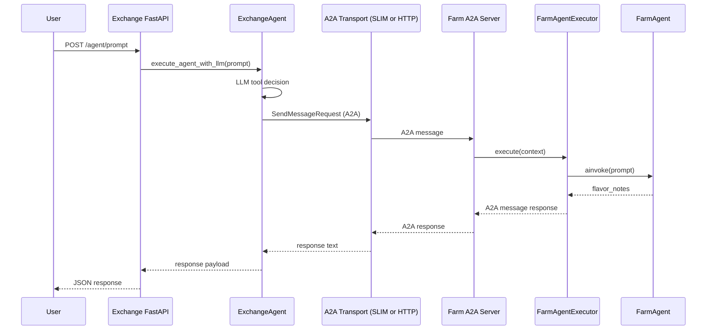

# Learning

## Overview
- `README.md` summarizes the Corto scenario: an Exchange agent, a Farm agent, and a React dashboard wired together so you can exercise SLIM/NATS transports, observability, and LangGraph orchestration.
- `pyproject.toml` plus `uv.lock` pin the Python depgraph that the demo folders and CI workflows expect, while `.env copy.example` documents the runtime knobs (`LLM_MODEL`, transport endpoints, Observe/OTEL vars).
- `docker-compose.yaml` orchestrates the demo stack locally, so any change to the Compose services should stay in sync with the README instructions and `tests/README.md` for integration validation.
- `docker-compose.aml314b.yaml` is the separate AML-only Docker path. It starts only `slim`, `aml-fi-a`, and `aml-fi-b`, leaving the coffee demo compose flow unchanged.
- `docker-compose.aml314b.yaml` sets `name: corto-aml314b` so Docker Compose lifecycle commands stay isolated from the existing coffee stack even though both files live under `coffee_agents/corto/`.
- The AML-only compose path also forces `AML314B_ENABLE_TRACING=false`, `AML314B_ENABLE_LAYERED_DISCLOSURE=false`, and `AML314B_USE_LLM_RISK_CLASSIFIER=false`. Without those overrides, the bilateral AML services can still enable Observe decorators or LLM-backed disclosure logic internally and fail even when OTEL export is disabled.

## Core Application Modules
- `common/` houses LLM plumbing: `llm.py` chooses between Litellm and a proxy OpenAI client, `litellm_oauth2_openai_provider.py` implements token refresh and stream helpers, `chat_lite_llm_shim.py` exposes that provider to LangChain, and `version.py` reports dependency versions by parsing `pyproject.toml`, the Docker config, or Git tags.
- `config/` reads `.env` variables, exposes `DEFAULT_MESSAGE_TRANSPORT`, `FARM_AGENT_*`, LLM credentials, and logging (`logging_config.py`) so every process can stay in sync.
- `exchange/` contains the FastAPI entrypoint (`main.py`), the LangGraph-powered `ExchangeAgent` (`agent.py`), suggested prompts, and the `frontend/` React app that talks to `/agent/prompt`—the agent routes prompts via tool calls that turn into A2A messaging using the farm’s card definition.
- `farm/` implements the backend agent: `farm_server.py` mounts `FarmAgentExecutor`, `agent.py` defines LangGraph nodes (`flavor_node`), `card.py` describes the A2A card/skills, and `agent_executor.py` adapts HTTP/A2A requests into LangGraph invocations.
- `aml314b/` is the shared AML 314(b) Phase 1.a lane. It is deterministic (no LLM) and defines the core contracts and enforcement hook used by both institutions.
- `aml314b/schemas.py` freezes the message contracts from `PROJECTBRIEF.md` as `B314Request` and `B314Response`. Responses do not include `case_id`, so enforcement hooks accept an explicit `case_id` context when logging responses.
- `aml314b/stores.py` implements CSV-backed stores: read-only `ActiveInvestigationsStore`, `KnownHighRiskEntitiesStore`, `CuratedInvestigativeContextStore` (now with optional activity windows), append-only `RetrievedInformationStore`, and the `InternalInvestigationsTriggerStore` for Phase 1.b risk escalation.
- `aml314b/enforcement.py` is the placeholder enforcement layer. Every send/receive path calls it. It validates schema, applies static rules, and records structured enforcement events for both request and response directions.
- `aml314b/bilateral.py` provides an in-process end-to-end runner using an ASGI transport so we can exercise FI-A -> FI-B over HTTP without Docker. `aml314b/demo.py` is a simple entry point that runs this flow.
- `fi_a/` is the Requestor institution. `fi_a/agent.py` reads ACTIVE cases, builds requests, enforces outbound policy, sends to FI-B over HTTP, enforces inbound response policy, and persists results to `RetrievedInformationStore`.
- `fi_a/main.py` is a FastAPI service that autostarts on boot (controlled by `AML314B_REQUESTOR_AUTOSTART`) and immediately processes ACTIVE cases. It also exposes `POST /aml314b/run`, `POST /aml314b/run/{case_id}`, `GET /aml314b/retrieved`, and `GET /health`.
- `fi_b/` is the Responder institution. `fi_b/tools.py` defines deterministic tools to match entities and build bounded context summaries. `fi_b/risk.py` provides a risk classifier interface with a deterministic stub and an LLM-backed implementation. `fi_b/agent.py` enforces inbound requests, evaluates them against FI-B stores, triggers internal investigations on high-risk activity summaries, and enforces outbound responses.
- `fi_b/main.py` is the FI-B FastAPI service. It exposes `POST /aml314b/request` and `GET /health`. `fi_b/a2a_server.py` runs the A2A server for SLIM or HTTP transport using `fi_b/agent_executor.py`.
- `fi_a/data/` and `fi_b/data/` hold the default CSV fixtures used by the AML lane. These paths are wired through environment-backed config in `config/config.py`.

## Supporting Scripts & Tests
- `docker/` keeps the Dockerfiles for the exchange server, farm server, the AML image recipe, and the UI plus `ui-build-and-serve.sh` for front-end builds; `config/docker/` stores SLIM and OTEL configs that Compose mounts.
- `deployment/helm/` holds Helm charts for `exchange`, `farm`, `corto-ui`, and a `local-cluster` wrapper, useful when exporting the demo into Kubernetes or CI.
- `tests/` centers on integration checks (`tests/integration/`), with helpers (`docker_helpers.py`, `process_helper.py`), fixtures (`conftest.py`), and `test_sommelier.py` to cover the core flow; `test_aml314b_bilateral.py` covers the new deterministic FI-A/FI-B bilateral lane in-process so it does not require the transport stack to be running.
- `pytest.ini` forces `pythonpath = .` so the runners find the packages, and additional markers like `@pytest.mark.farms` live there.
- `PHASE1A_EXECPLAN.md` is the living execution plan for the new bilateral AML 314(b) lane; it scopes work to Phase 1.a and describes the planned `aml314b/` package, fixtures, enforcement layer, and integration test entry points.
- `SKIP_SESSION_SERVICES=true` can be set when running pytest to bypass the session-scoped Docker Compose fixture; this is useful for the deterministic AML lane tests in environments without Docker.
- `tests/integration/conftest.py` now checks `SKIP_SESSION_SERVICES` before trying to start Docker services, and `test_aml314b_bilateral.py` pins AnyIO to the `asyncio` backend so it does not require `trio`.

## Observability & Assets
- `corto_dashboard.json` defines a Grafana dashboard (ClickHouse data links, trace/table panels) so you can pull traces created by Observe SDK and the agents.
- `images/` stores screenshots referenced in the README to illustrate dashboards and UI states.
- `corto_dashboard.json` plus the ClickHouse/Grafana services in Compose complete the observability lane mentioned in the README.

We'll keep this file updated as the folder gains new helpers, scripts, or dashboards so future contributors land here first when exploring Corto.

## Corto Common Folder Notes
- The Corto `common/` folder lives at `coffeeAgntcy/coffeeAGNTCY/coffee_agents/corto/common`.
- `common/llm.py` is the entry point for model clients. It uses `ChatOpenAI` when `LITELLM_PROXY_BASE_URL` and `LITELLM_PROXY_API_KEY` are set, otherwise it falls back to `ChatLiteLLM`. If `LLM_MODEL` starts with `oauth2/`, it swaps in the OAuth2 shim client.
- `common/chat_lite_llm_shim.py` is a shim (a thin compatibility layer) that preserves the LiteLLM interface (`completion` / `acompletion`) while routing calls through the custom OAuth2 provider.
- `common/litellm_oauth2_openai_provider.py` implements the OAuth2 client-credentials flow, caches short-lived tokens, calls an OpenAI-compatible endpoint, and adapts both streaming and non-streaming responses into LiteLLM `ModelResponse` objects.
- OAuth2 here is used to ensure only authorized clients can call the model gateway via short-lived access tokens, instead of long-lived static API keys.
- For service-to-service networks (e.g., 5 trusted nodes), OAuth2 (often with JWT access tokens) can help block an untrusted 6th node that cannot obtain a valid token. For stronger proof of origin on each message, consider signed JWTs and/or mTLS in addition to OAuth2.
- `common/version.py` collects build metadata and key dependency versions with layered fallbacks. It prefers `about.properties`, fills gaps using the latest Git tag, normalizes the build date, and reports select dependency versions from `pyproject.toml` plus the `ghcr.io/agntcy/slim` image tag from `docker-compose.yaml`.
- `get_version_info(...)` is used by the `/about` endpoint in `coffeeAgntcy/coffeeAGNTCY/coffee_agents/corto/exchange/main.py:78`, where it reads `about.properties` and returns version/build/dependency metadata.

## Corto Transport Notes
- Corto uses **A2A over SLIM** via the app-sdk transport layer (not the low-level SLIM session API).
- The Exchange agent creates an A2A client with a SLIM transport and uses request-reply routing to the Farm agent (`exchange/agent.py`).
- The Farm agent runs an A2A server and registers it into an app session when `DEFAULT_MESSAGE_TRANSPORT` is not `"A2A"` (`farm/farm_server.py`).
- The SLIM gateway is configured in `config/docker/slim/server-config.yaml` and exposed at `http://slim:46357` via Docker Compose.
- The AML-only compose path also uses A2A over SLIM, but keeps `slim` internal to the Docker network instead of publishing `46357` on the host.

## Corto Config Notes
- `config/config.py` loads `.env` / `.env.local` and centralizes runtime settings: transport defaults, farm host/port, `LLM_MODEL`, OAuth2 client credentials, `LOGGING_LEVEL`, and AML 314(b) Phase 1.a host/port/path settings (with computed defaults like `AML314B_RESPONDER_BASE_URL`).
- `config/logging_config.py` defines `setup_logging()` which configures global logging format/level and reduces verbosity for noisy libraries (`openai`, `httpcore`, `httpx`).

## AML UI Notes
- The current UI at `exchange/frontend/` is a coffee chat UI and does not display AML 314(b) results. Use it as a template, but expect to add a new AML-focused view.
- AML 314(b) demo cases live in `fi_a/data/active_investigations.csv`. Add cases there to drive match/no-match/partial-match outcomes.
- FI-A exposes AML endpoints you can wire a UI to: `POST /aml314b/run`, `POST /aml314b/run/{case_id}`, and `GET /aml314b/retrieved` (in `fi_a/main.py`).
- The AML-only Docker compose path is backend-only. It exposes `FI_A` on port `8011`, but it does not start the AML frontend.

## AML FastAPI, LogBuffer, and StepEventBuffer
- In the AML 314(b) lane, FastAPI is the HTTP wrapper around `FI_A_Agent`, not the business-logic engine itself.
- `fi_a/main.py` uses FastAPI to initialize runtime dependencies on startup: `ActiveInvestigationsStore`, `CounterpartyDirectoryStore`, `RetrievedInformationStore`, `PlaceholderEnforcementLayer`, `A2AResponderClient`, `RequestorAgent`, `LogBuffer`, and `StepEventBuffer`.
- FastAPI also exposes the control and read APIs used by the AML UI and tests: `POST /aml314b/run`, `POST /aml314b/run/{case_id}`, `GET /aml314b/retrieved`, `GET /aml314b/logs`, `GET /aml314b/steps`, and `GET /health`.
- `LogBuffer` in `fi_a/log_buffer.py` is an in-memory rolling store of AML log lines. It is populated indirectly through `LogBufferHandler`, which subscribes to Python logging and records loggers prefixed with `corto.aml314b`.
- The role of `LogBuffer` is observability and debugging. It powers the UI’s live log feed via `GET /aml314b/logs`, but it is not durable storage and is not used for enforcement decisions.
- `StepEventBuffer` in `aml314b/step_events.py` is different: it stores structured workflow milestones such as `fi_a_preparing_request`, `fi_b_response_sent`, and `fi_a_response_received`.
- `StepEventBuffer` is populated directly by AML workflow code, especially `fi_a/agent.py`, plus step events returned from `FI_B` through `fi_b/agent_executor.py`.
- Practical distinction: `LogBuffer` answers “what happened in the system?” while `StepEventBuffer` answers “where is this case in the workflow?”
- The AML frontend uses both. It polls `GET /aml314b/logs` for free-form execution detail and `GET /aml314b/steps` for the ordered case-status timeline shown in the UI.

## Lungo Group Communication Notes
- Lungo implements group conversation using **A2A over SLIM**, not raw SLIM session APIs.
- The logistics supervisor broadcasts to multiple agents with `start_groupchat` / `start_streaming_groupchat` in `coffeeAgntcy/coffeeAGNTCY/coffee_agents/lungo/agents/supervisors/logistics/graph/tools.py`.
- The group conversation architecture and run steps are documented in `coffeeAgntcy/coffeeAGNTCY/coffee_agents/lungo/docs/group_conversation.md`, and Lungo’s `README.md` links to it.
- Lungo’s `.env.example` notes that **SLIM is required** for group conversation.

## Corto Docker Config Notes
- The files in `config/docker/` are mounted by Docker Compose to configure **infrastructure services**, not app logic.
- Edit `config/docker/slim/server-config.yaml` if you need to change SLIM gateway behavior (ports, TLS settings, runtime/threading).
- Edit `config/docker/otel/otel-collector-config.yaml` if you need to change OTEL receivers/exporters (for example, sending traces/metrics somewhere other than ClickHouse).
- `docker/Dockerfile.aml314b` is the shared AML image recipe. It installs `uv`, pins dependency installation to `/venv` with `VIRTUAL_ENV` and `UV_PROJECT_ENVIRONMENT`, syncs from `pyproject.toml` and `uv.lock`, and copies the `corto` source tree.
- `aml314b/data/counterparty_directory.docker.csv` is the compose-specific AML address book. It replaces localhost-only routing with Docker service names and points the SLIM route to `http://slim:46357`.

## Exchange vs AML Roles
- The Exchange/Farm demo follows a simple request/response pattern: Exchange sends the prompt to Farm and returns the response.
- For AML 314(b), FI-A plays the **requester** role (analogous to Exchange) and FI-B plays the **responder** role (analogous to Farm).
- The pattern is similar, but the AML lane is **deterministic and not user-prompt driven**; it uses the FI-A/FI-B services (`fi_a/`, `fi_b/`) rather than the Exchange/Farm UI flow.

## Farm Transport Config + Message Flow
- `DEFAULT_MESSAGE_TRANSPORT` selects how the farm is exposed: `"A2A"` uses a local Starlette HTTP server, anything else (default `SLIM`) uses the app-sdk transport bridge.
- `TRANSPORT_SERVER_ENDPOINT` is the SLIM (or other transport) gateway URL used when bridging.
- `FARM_AGENT_HOST` and `FARM_AGENT_PORT` only apply when `DEFAULT_MESSAGE_TRANSPORT == "A2A"` and control the farm’s local HTTP bind.
- The Exchange HTTP API (`exchange/main.py`) accepts `POST /agent/prompt` and delegates to `ExchangeAgent.execute_agent_with_llm(...)`.
- The Exchange agent uses an LLM tool call to decide when to forward a prompt; if it does, it builds an A2A client using `DEFAULT_MESSAGE_TRANSPORT` and `TRANSPORT_SERVER_ENDPOINT`, then sends a `SendMessageRequest` to the Farm agent topic from its A2A card.
- The Farm server (`farm/farm_server.py`) wraps `FarmAgentExecutor` in a `DefaultRequestHandler` so incoming A2A messages become executor calls. The executor runs `FarmAgent.ainvoke(...)` and returns the flavor notes as an A2A message.

## A2A vs SLIM Transport (Pros/Cons)
- A2A is the protocol; SLIM is a transport. In Corto, A2A runs over either HTTP (when `DEFAULT_MESSAGE_TRANSPORT="A2A"`) or SLIM (when set to `SLIM`).
- A2A over HTTP pros: simplest local setup, fewer moving parts, and easy traffic inspection with standard HTTP tools.
- A2A over HTTP cons: less suited for multi-agent routing or service discovery and does not provide a shared transport fabric.
- A2A over SLIM pros: better for multi-agent fabrics, decouples agents from direct URLs using routable names/topics, and scales to distributed deployments.
- A2A over SLIM cons: requires extra infrastructure (SLIM gateway + config) and adds an extra routing layer to debug.

## Helm Deployment Note (Independent Entities)
- The Helm charts are convenience deployables, not a requirement to co-host Exchange and Farm.
- In real deployments, Exchange (FI-A) and Farm (FI-B) can run in separate clusters or environments; you can install only the chart you need in each place.
- The `local-cluster` Helmfile is primarily for demos and integration testing where running the full stack in one place is useful.

## Demo Compose Network Decision
- For this reference implementation, it is reasonable to keep Exchange and Farm on the **same Docker Compose network**.
- Background: a single Compose file automatically creates a shared network, which provides built-in service discovery so containers can call each other by service name (for example, `http://farm-server:9999` or `http://slim:46357`) without external DNS.
- This keeps the demo setup simple (`docker compose up`) and matches the existing `docker-compose.yaml` assumptions. Split into separate Compose files only when you want a more realistic, institution‑separated deployment.

## README Compose vs Local Python
- The README’s **Option 1** (“Docker Compose”) is a **single command**: `docker compose up` starts the full stack.
- The **four-step** sequence in the README applies to **Option 2** (“Local Python Development”), where you run SLIM/observability, farm, exchange, and UI in separate terminals.

## Test Reuse for AML
- The test **harness and fixtures** in `tests/integration/conftest.py` and `tests/integration/process_helper.py` are reusable for AML flows (env setup, agent process management, FastAPI TestClient).
- `tests/integration/test_aml314b_bilateral.py` is already AML‑specific and should be extended for match/no‑match/partial‑match scenarios and enforcement event validation.
- `tests/integration/docker_helpers.py` can be reused if you still want transport/observability services in tests.
- The coffee‑specific **sommelier test** (`tests/integration/test_sommelier.py` + `prompt_cases.json`) is not reusable for AML because it uses semantic similarity on flavor prompts.

## OTEL (Observability) Notes
- OTEL = OpenTelemetry. It is used for collecting traces and metrics, not for agent messaging.
- In Corto, agents emit telemetry, the **OTEL Collector** receives it on ports 4317/4318, and exports traces/metrics to ClickHouse so Grafana can visualize them.
- OTEL is optional for the demo; you can omit the collector/ClickHouse/Grafana stack if you do not need observability.
- The AML-only compose path explicitly sets `OTEL_SDK_DISABLED=true` so the bilateral AML demo can run without the observability stack.
