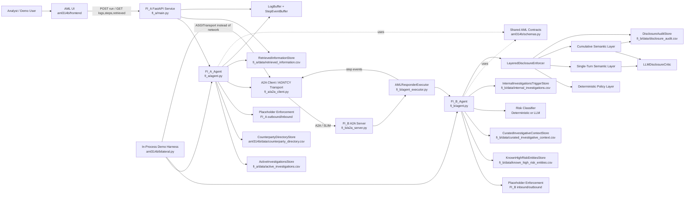

# AML314B Architecture

## Summary

The AML314B lane is organized around two agent services and a shared domain layer:

- `FI_A_Agent` reads active investigations, resolves counterparty routes, enforces outbound and inbound policy checks, sends requests, and persists retrieved responses.
- `FI_B_Agent` receives requests, enforces policy checks, evaluates entity, context, and risk data, optionally applies layered disclosure review, and returns bounded responses.
- `aml314b/` provides the shared schemas, stores, placeholder enforcement layer, step-event utilities, and optional layered disclosure enforcement modules.
- `aml314b/frontend/` polls `FI_A` APIs for run status, logs, steps, and retrieved information.

## Component Inventory

- Shared contracts and persistence: `aml314b/schemas.py`, `aml314b/stores.py`
- Shared baseline enforcement: `aml314b/enforcement.py`
- Optional layered disclosure enforcement: `aml314b/enforcement_disclosure/`
- `FI_A_Agent` orchestration: `fi_a/agent.py`
- `FI_A` API surface: `fi_a/main.py`
- `FI_A` transport adapter: `fi_a/a2a_client.py`
- `FI_B_Agent` orchestration: `fi_b/agent.py`
- `FI_B` transport server: `fi_b/a2a_server.py`
- `FI_B` A2A executor: `fi_b/agent_executor.py`
- AML UI: `aml314b/frontend/src/App.tsx`
- In-process demo harness: `aml314b/bilateral.py`

## Mermaid Diagram

## Runtime Notes

- `FI_A` reads `fi_a/data/active_investigations.csv` and resolves counterparties from `aml314b/data/counterparty_directory.csv`.
- `FI_A` persists successful inbound responses to `fi_a/data/retrieved_information.csv`.
- `FI_B` reads known entities and curated context from CSV-backed stores under `fi_b/data/`.
- If activity suggests risk without a known-entity match, `FI_B` can trigger `fi_b/data/internal_investigations.csv`.
- When layered disclosure is enabled, `FI_B` audits each disclosure review to `fi_b/data/disclosure_audit.csv`.
