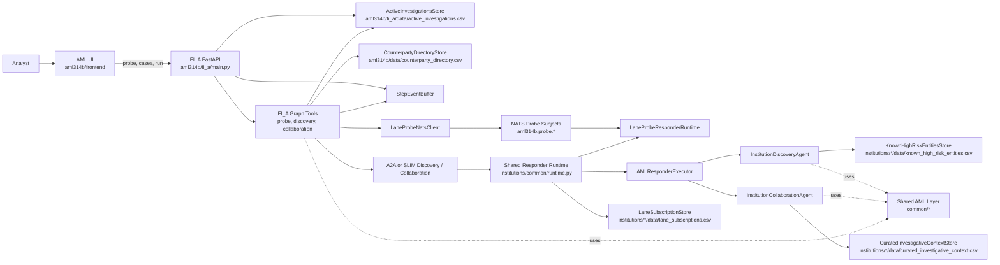

# AML314B Architecture

## Summary

The multilateral AML314B runtime is organized around four layers:

- `fi_a/` exposes the supervisor API, resolves seeded FI_A cases, probes lane membership, runs explicit discovery, and starts scoped collaboration.
- `institutions/` provides thin wrappers for `FI_B` through `FI_F`, each backed by a shared responder runtime plus local CSV fixtures.
- `common/` defines the shared request and response schemas, lane metadata, stores, enforcement hooks, collaboration helpers, and step-event buffering used by both sides.
- `frontend/` is a standalone AML UI that drives the structured probe -> case selection -> discovery or collaboration flow against the FI_A API.

## Component Inventory

- Shared contracts and lane metadata: `aml314b/common/schemas.py`, `aml314b/common/channeling.py`
- Shared stores and persistence helpers: `aml314b/common/stores.py`
- Shared enforcement and collaboration helpers: `aml314b/common/enforcement.py`, `aml314b/common/collaboration.py`
- Lane probe transport: `aml314b/common/probing.py`
- Step-event buffering: `aml314b/common/step_events.py`
- FI_A API surface: `aml314b/fi_a/main.py`
- FI_A graph orchestration: `aml314b/fi_a/graph/graph.py`, `aml314b/fi_a/graph/tools.py`
- FI_A transport client: `aml314b/fi_a/a2a_client.py`
- Shared responder runtime and executor: `aml314b/institutions/common/runtime.py`, `aml314b/institutions/common/agent_executor.py`
- Shared responder logic: `aml314b/institutions/common/discovery_agent.py`, `aml314b/institutions/common/collaboration_agent.py`
- Institution entrypoints: `aml314b/institutions/fi_b/server.py` through `aml314b/institutions/fi_f/server.py`
- AML UI: `aml314b/frontend/src/App.tsx`

## Mermaid Diagram

## Runtime Notes

- `POST /agent/probe` normalizes `investigation_type`, publishes a coarse NATS probe on `aml314b.probe.money_mule` or `aml314b.probe.terrorist_financing`, and resolves the `YES` responders back through the directory for the active transport.
- `GET /agent/cases` reads seeded FI_A investigations from `aml314b/fi_a/data/active_investigations.csv` and returns the active cases for the requested lane.
- `POST /agent/cases/run` executes structured discovery or discovery plus collaboration from a selected case and appends lane-aware step events to the in-memory `StepEventBuffer`.
- Prompt endpoints still exist for compatibility, but the primary runtime path is lane-first and case-first rather than prompt parsing.
- Each responder loads local lane subscriptions, known high-risk entities, and curated investigative context from institution-local CSV files under `aml314b/institutions/fi_*/data/`.
- In `A2A`, FI_A sends directly to responder HTTP endpoints from the directory. In `SLIM`, each responder registers lane-scoped topics and validates `transport_lane` metadata against the selected investigation type.
- The NATS probe stage is separate from the later discovery or collaboration session. It only establishes the candidate cohort for the chosen investigation lane.
